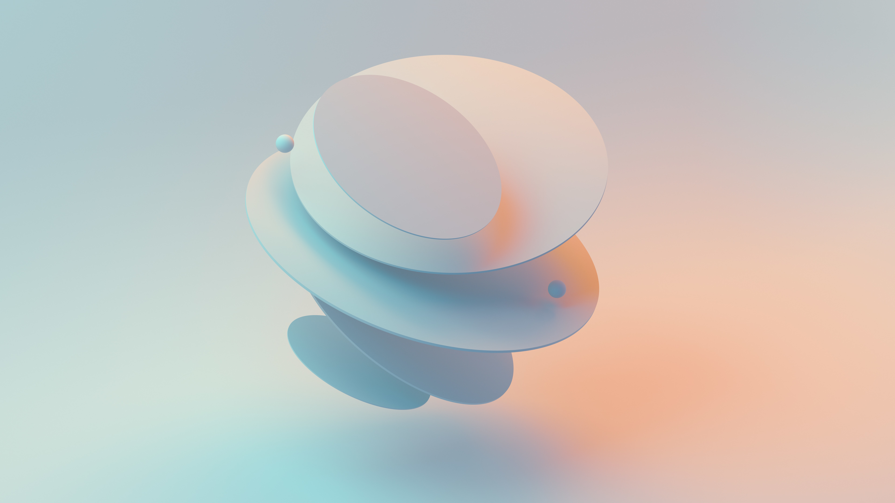

# Benchmarks of popular jpeg libraries

Here I compare how long it takes popular JPEG decoders to decode the below 7680*4320 image
of [Cutefish OS](https://en.cutefishos.com/) default wallpaper.

Currently due to this library's limitation, I can't add other sub-sampled and progressive images benchmarks, but
I will add them when I implement them.

## About benchmarks
Benchmarks are weird, especially IO  & multi-threaded programs.
This library uses both of the above hence performance may vary.

For best results shut down your machine, go take coffee, think about life and 
how it came to be and why people should save the environment.

Then power up your machine, if it's a laptop connect it to a power supply and 
if there is a setting for performance mode, tweak it. 

Then run.

## Benchmarks vs real world usage
The library may be fast, okay it is fast.

But real world usage may vary.

Notice that I'm using a large image but probably most
decoding will be small to medium images.

Because the library is multi-threaded. We may end up being
slower than competition due to mutex locks and every other thing
that happens with multi-threaded code so please take these benchmarks as a grain of sand.

I just use them to show if I can improve some parts.

## Reproducibility
The benchmarks are carried out on my local machine with an AMD Ryzen 5 4500u

The benchmarks are reproducible. 

To reproduce them
1. Clone this repository
2. Install rust(if you don't have it yet)
3. `cd` into the directory. 
4. Run `cargo bench`

# Finally benchmarks

## 1. RGB

### 1 * 1 (No upsampling) Baseline RGB Decoding

|Decoder | Link | Speed|
|--------|-------|-----|
|**zune-jpeg**|- | 60.246 ms |
|libjpeg-turbo| [github-link]|98.343 ms|
|image-rs| [link] |123.350 ms |

Yaay almost twice as fast as `image-rs/decoders` and 40% faster than `libjpeg-turbo`

## Grayscale
### 1*1 Baseline grayscale decoding.

|Decoder | Link | Speed|
|--------|-------|-----|
|**zune-jpeg**|- | 39.598 ms |
|libjpeg-turbo| [github-link]|45.648 ms|
 
Not much improvement on my side, but libjpeg-turbo made some quantum leaps 50% improvement...

Image-rs/jpeg-decoder does not support YCbCr->Grayscale decoding, hence it wasn't included in the benchmark

## Horizontal Sub-sampling

|Decoder | Link | Speed|
|--------|-------|-----|
|**zune-jpeg**|- | 69.246 ms |
|libjpeg-turbo| [github-link]|85.343 ms|
|image-rs| [link] |124.350 ms |

23% faster than libjpeg-turbo.

79% faster than image-rs.

Image-rs remained almost the same compared to RGB no upsampling here.

[github-link]:https://github.com/libjpeg-turbo/libjpeg-turbo
[link]:https://github.com/image-rs/jpeg-decoder